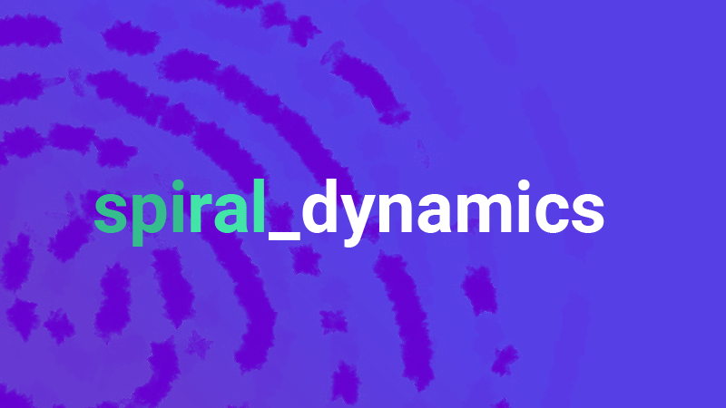
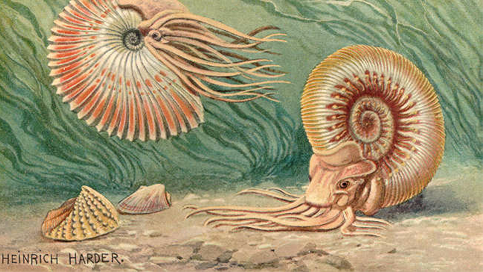
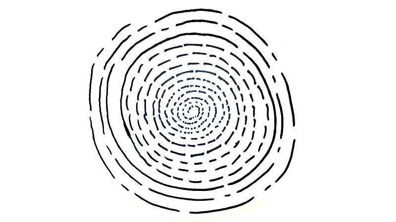

--- 
authors: 
  - "Marius Claßen"
authors-url: 
  - "https://github.com/mariusclassen"
layout: project
title: spiraldynamics
type: project
---

## Assignment
In the first project the aim was to formulate an analogous algorithm precisely in one sentence. This should be executed by at least 10 people. With the analysis of the results the algorithm was further improved. On the one hand it should be ensured that the results have a similar character but on the other hand they have enough individuality. The right choice of the material, the tools and the format was important. Constants and variables had to be defined and rewritten over and over again.

## Inspiration
The algorithm is derived from ammonite patterns. The drawing is individual with every ammonite. It begins very small in the middle and becomes larger in the shape of a spiral. This served as a starting point to visualize music.

>[Source: Fractal Foundation](http://www.copyrightexpired.com/Heinrich_Harder/ammonoid.html)

## Idea
The user starts with the drawing from the center and works outwards in a spiral shape. Using the music he determines the visualization in the form of size, posit ion, color and style.

## Parameters/Variables
The result of the algorithm should always be in the form of a spiral so that the different results remain comparable. In addition it was important that the user chose a song and listened to it for a maximum of 2 minutes. Another parameter was the visualization by strokes, which the user draws during the song.
The material,  the tools and the music should be freely selectable. 

## Definition
1. Pick up a material and a writing tool
2. Listen to a song for 2 minutes
3. Draw in this time lines from the inside to the outside so that the result is a spiral
4. Adjust your strokes to the music

## First Result
The results were very different. Unfortunately the users used only Din A4 paper on which they drew with Fineliners.
On the other hand the spiral pattern worked very well. Only the way the strokes were plotted in shape, size and position looked very arbitrary and had no character of an algorithm.

## 1. Iteration
1. Pick up a material and a writing tool
2. Listen to a song for 2 minutes
3. Draw in this time lines from the inside to the outside so that the result is a spiral
4. The lines may be parallel or vertical to the guide line
5. Adjust your strokes to the music

Even after the first iteration there seems to be no improvement in execution. The word „strokes“ is a term that is very spongy formulated and offers much scope for interpretation. According to this experience the aim was to formulate the algorithm sharper without losing the playful character. Thus in the second iteration circles and points were placed. These also made themselves better for different speeds in musical pieces. In addition the word "tools" was replaced by "pens or brushes" and a ductus was added. For the result to get a frame and not just end on a Din A4 sheet, the sheet should be torn to a circle. The most important point in the algorithm was the hint for the user to observe the rhythm and volume of the piece of music and visualize it.

## 2. Iteration
1. Take a leaf and tear it to a circle
2. Use pens or brushes with different shapes
3. Listen to a song with a length of about 3 minutes
4. Draw in this time points and circles from the inside to the outside so that the result is a spiral
5. The lines may be parallel or vertical to the guide line
6. Adjust your work in terms of rhythm and volume to the music

Many questions arose how large the circle should be. Therefore it was important to determine the size accurately. Since the users were still using simple tools such pens the algorithm had to be formulated even more precisely. In the next iteration was an indication that the colors should run. The users were busy with the selection of the song in the entire process why it was important to specify the song. This allowed better comparisons.

## 3. Iteration
1. Pull out a circle in the size of your palm from a piece of paper
2. Use colors which interlace on the paper or form elevations (watercolor, acrylic, Tippex, etc.)
3. Listen to this song (3:44 min): https://www.youtube.com/watch?v=zsyjS_vJfkw
4. Draw points as well as circles from the inside to the outside in order to form a spiral
5. Adjust your work to the music in terms of rhythm and volume

## Conclusion
The last iteration shows the best results. Above all point two and point three are decisive for this. The whole process shows how important it is to develop accurate formulations to produce similar results but do not look too arbitrary.

## License (MIT)

_© Fh Potsdam · University of applied sciences · Edmundo Mejia Galindo WS2016/17 3. Semester Interface Design · Grundlagen Generative Gestaltung · Lecturer: Fabian Morón Zirfas · February 2017_

This is free and unencumbered software released into the public domain.

Anyone is free to copy, modify, publish, use, compile, sell, or
distribute this software, either in source code form or as a compiled binary, for any purpose, commercial or non-commercial, and by any means.

In jurisdictions that recognize copyright laws, the author or authors of this software dedicate any and all copyright interest in the software to the public domain. We make this dedication for the benefit of the public at large and to the detriment of our heirs and successors. We intend this dedication to be an overt act of relinquishment in perpetuity of all present and future rights to this software under copyright law.

THE SOFTWARE IS PROVIDED "AS IS", WITHOUT WARRANTY OF ANY KIND,
EXPRESS OR IMPLIED, INCLUDING BUT NOT LIMITED TO THE WARRANTIES OF MERCHANTABILITY, FITNESS FOR A PARTICULAR PURPOSE AND NONINFRINGEMENT. IN NO EVENT SHALL THE AUTHORS BE LIABLE FOR ANY CLAIM, DAMAGES OR OTHER LIABILITY, WHETHER IN AN ACTION OF CONTRACT, TORT OR OTHERWISE, ARISING FROM, OUT OF OR IN CONNECTION WITH THE SOFTWARE OR THE USE OR OTHER DEALINGS IN THE SOFTWARE.

For more information, please refer to

See also http://unlicense.org/
